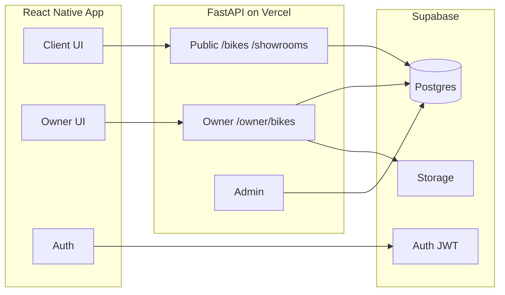

# RevvUp — System Architecture

## High-level

## Multi-vendor rule

Every bike row has `owner_id` referencing `profiles.id` for a showroom owner. Public endpoints return **all** rows; owner endpoints filter `WHERE owner_id = current_user`.

## Submodule repos

| Repo | Responsibility |
| ---- | -------------- |
| `revvup-app` | Docs, submodule pointers, workspace |
| `revvup-frontend` | Expo app, role navigators |
| `revvup-backend` | REST API, email approval |
